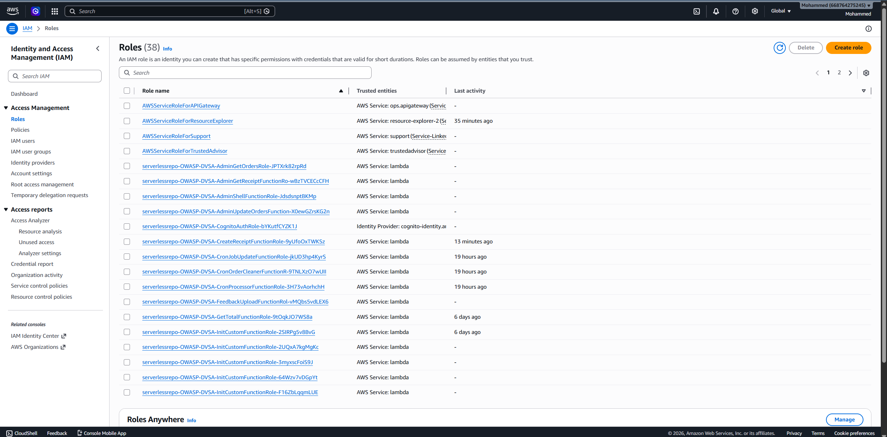
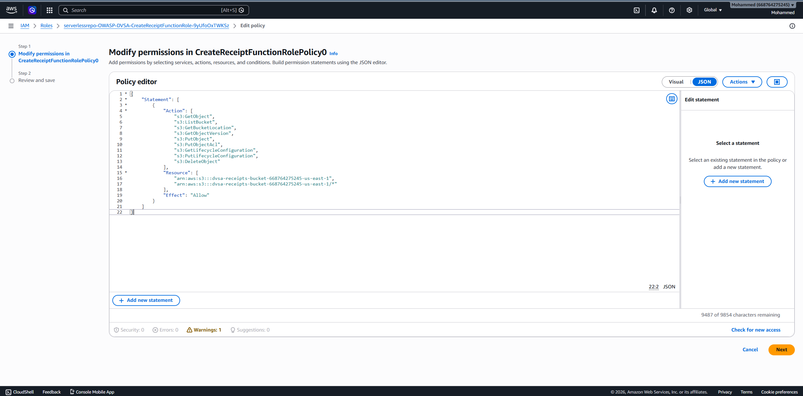

# Lesson 4 – IAM Misconfiguration

## Summary
The DVSA application uses IAM roles with overly permissive policies. These roles grant unnecessary access to AWS resources, especially S3, which can lead to security risks.

## Vulnerability
- Over-Permissive IAM Role
- Improper Access Control

## Root Cause
The IAM policy attached to the Lambda execution role allows broad actions such as:
- s3:GetObject
- s3:PutObject
- s3:ListBucket

These permissions are granted without strict resource limitations.

## Exploitation Steps
1. Navigate to AWS Console.
2. Open IAM service.
3. Go to Roles.
4. Select DVSA Lambda execution role.
5. Inspect attached policies.
6. Review allowed actions and resources.

## Impact
An attacker with access to the role can:
- read sensitive data from S3
- upload or modify objects
- potentially escalate privileges

## Result
The IAM role was found to have excessive permissions that violate the principle of least privilege.

## Evidence

### Figure 1 – IAM Roles

### Figure 2 – Policy Permissions

## Fix Overview
- apply least privilege principle
- restrict S3 access to specific resources only
- remove unnecessary actions
- audit IAM roles regularly

## Video Demonstration
[Add your video link here]