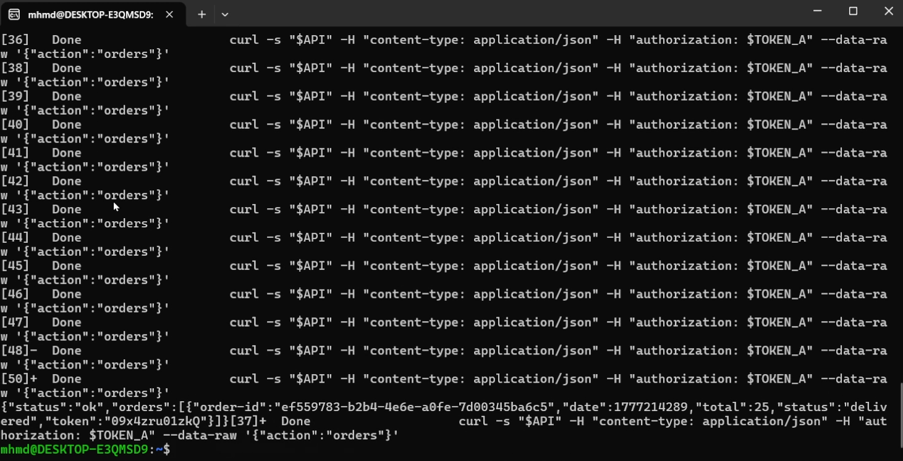
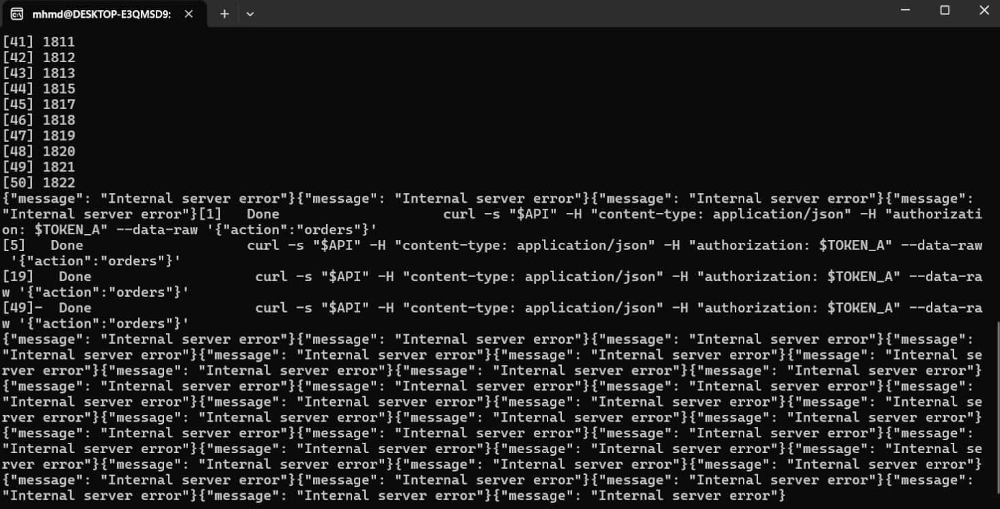

# Lesson 6 – Denial of Service (DoS)

## Summary
The DVSA application is vulnerable to Denial of Service (DoS) attacks. By sending a large number of concurrent requests, the backend becomes unstable and starts returning errors.

## Vulnerability
- Denial of Service (DoS)
- Lack of rate limiting
- Resource exhaustion

## Root Cause
The API does not implement any rate limiting or request throttling. As a result, multiple concurrent requests can overwhelm the backend system.

## Exploitation Steps
1. Open terminal.
2. Use a loop to send multiple requests simultaneously.
3. Observe backend behavior under load.
4. Notice server instability and error responses.

## Impact
An attacker can:
- overwhelm the API server
- cause service disruption
- prevent legitimate users from accessing the system

## Result
After sending multiple requests, the server returned:
- "Internal server error"
- inconsistent responses

This confirms the system cannot handle high request volume.

## Evidence

### Figure 1 – DoS Attack Execution

### Figure 2 – Server Failure (Internal Errors)

## Fix Overview
- implement rate limiting
- use API Gateway throttling
- apply request quotas
- introduce load balancing
- add caching where possible
- monitor traffic with CloudWatch

## Video Demonstration
Video link: [Google Drive](https://drive.google.com/file/d/15UI4jkxNHcCrDFIad6DhT51jKQ5MIUxx/view?usp=sharing)
