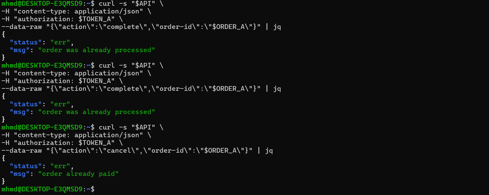

# Lesson 8 – Business Logic Vulnerability

## Summary
The DVSA application contains a business logic flaw in order processing. The system does not properly enforce valid state transitions for orders.

## Vulnerability
- Business Logic Vulnerability
- Improper order state validation

## Root Cause
The backend does not correctly validate order states before performing actions such as "complete" or "cancel". This allows invalid operations on already processed or paid orders.

## Exploitation Steps
1. Retrieve an existing order ID.
2. Attempt to complete the order multiple times.
3. Attempt to cancel an already processed or paid order.
4. Observe system responses.

## Impact
An attacker can:
- perform unauthorized actions on orders
- manipulate order workflow
- cause inconsistent system state

## Result
The system responds with:
- "order was already processed"
- "order already paid"

This shows improper enforcement of business rules.

## Evidence

### Figure 1 – Invalid Order Actions

## Fix Overview

To fix this issue, the backend must enforce strict order state validation.

Each action should only be allowed if the order is in the correct state:

- "complete" → only allowed if order is "pending"
- "cancel" → only allowed if order is "pending"

Any invalid state transition must be rejected by the system.

Additionally:
- validate order status before updating
- prevent repeated actions
- return proper error responses

## Video Demonstration
Video link: [Google Drive](https://drive.google.com/file/d/1SwntyT4hUCWEYCm_Va4nSBHocZAPdexa/view?usp=sharing)
